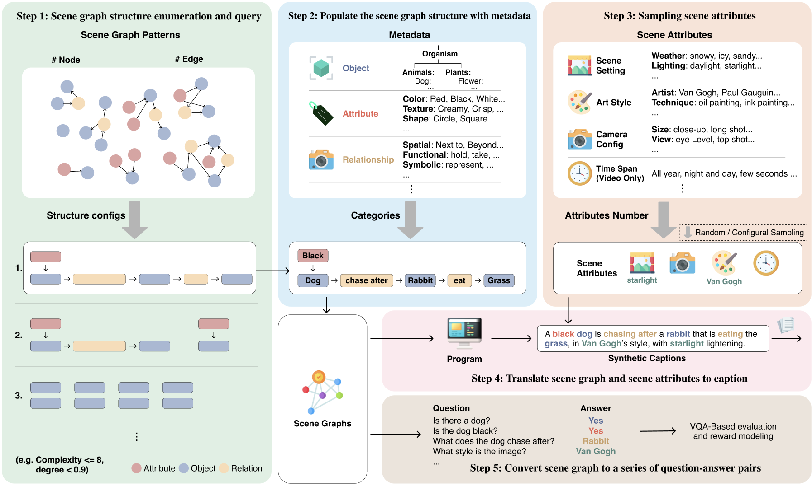
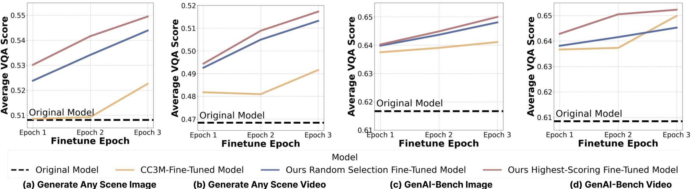
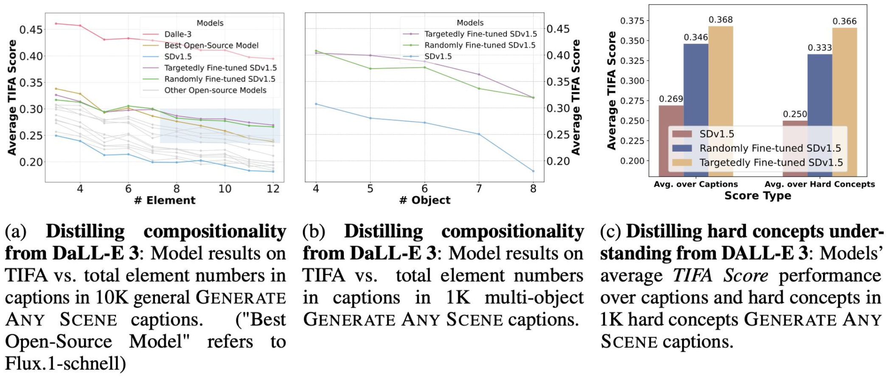
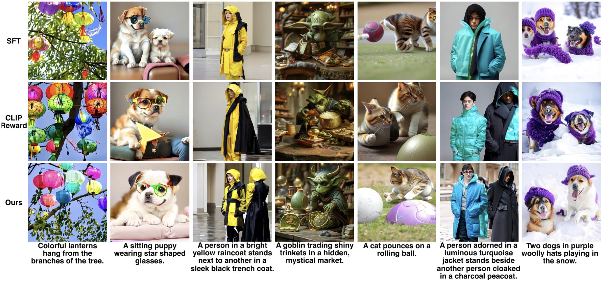
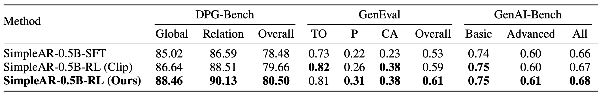

<h1 align="center"> [ICLR 2026] Generate Any Scene: Scene Graph Driven Data Synthesis for Visual Generation Training</h2>


<h2 align="center"> <a href="https://uwgzq.github.io/papers/GAS/">🌐 Website</a> | <a href="https://arxiv.org/abs/2412.08221">📑 Paper</a> | <a href="https://huggingface.co/datasets/UWGZQ/GenerateAnyScene">🤗 Caption Dataset</a>


We introduce **Generate Any Scene**, a data engine that systematically enumerates scene graphs representing the combinatorial array of possible visual scenes. **Generate Any Scene** dynamically constructs scene graphs of varying complexity from a structured taxonomy of objects, attributes, and relations. Given a sampled scene graph, Generate Any Scene translates it into a caption for text-to-image or text-to-video generation; it also translates it into a set of visual question answers that allow automatic evaluation and reward modeling of semantic alignment.

<!-- --- -->

<!-- **Ziqi Gao<sup>*</sup><sup>1</sup>, Weikai Huang<sup>*</sup><sup>1</sup>, Jieyu Zhang<sup>1</sup>, Aniruddha Kembhavi<sup>2</sup>, Ranjay Krishna<sup>1,2</sup>**

<sup>1</sup>University of Washington  
<sup>2</sup>Allen Institute for AI  
<sup>*</sup>Equal Contribution -->
<!-- --- -->


## Installation
Follow the steps below to set up the environment and use the repository:

```bash
# Clone the repository
git clone https://github.com/RAIVNLab/GenerateAnyScene.git
cd ./GenerateAnyScene
git submodule update --init --recursive

# Create and activate a Python virtual environment:
conda create -n GenerateAnyScene python==3.10.14
conda activate GenerateAnyScene

# Install the required dependencies:
pip install -r requirements.txt
pip install transformers==4.47.1 --force-reinstall --no-warn-conflicts
```
For the OpenSora 1.2 model, please refer to the [installation instructions](https://github.com/hpcaitech/Open-Sora#installation) provided in its official repository.

For text-to-3D generation, please follow the [setup guide](https://github.com/threestudio-project/threestudio/blob/main/docs/installation.md) from the ThreeStudio repository.

#### Note
If you prefer using pre-configured environments, we provide Docker images for both Text-to-Video and Text-to-3D tasks. To download the Docker containers:
```bash
docker pull uwziqigao/3d-gen:latest
docker pull uwziqigao/video_gen:latest
```

## Captions Generation
After downloading and setting up the repo, you can generate captions using the following command:
```bash
python generation.py \
  --metadata_path ./metadata \
  --output_dir ./output \
  --total_prompts 1000 \
  --num_workers 1 \  # enable parallelism by setting num_workers > 1
  --min_complexity 4 \
  --max_complexity 7 \
  --min_attributes 1 \
  --max_attributes 4 \
  --modality_type text2image # or text2video or text2threed for different modalities
```

## Generation and Evaluation
We also support a wide range of models evaluation and metrics, including:
1. **Text-to-Image Models**
- Stable Diffusion 3 Medium
- Stable Diffusion 2-1  
- SDXL
- PixArt-α  
- PixArt-Σ  
- Wuerstchen v2  
- DeepFloyd IF XL  
- FLUX.1-dev  
- FLUX.1-schnell  
- Playground v2.5  

2. **Text-to-Video Models**
- Text2Video-Zero 
- ZeroScope
- VideoCraft2  
- AnimateDiff  
- AnimateLCM  
- FreeInit  
- ModelScope  
- Open-Sora 1.2  
- CogVideoX-2B

3. **Text-to-3D Models**  
- Latent-NeRF  
- DreamFusion-sd 
- DreamFusion-IF  
- Magic3D-sd  
- Magic3D-IF  
- ProlificDreamer  
- Fantasia3D  
- SJC

4. **Metrics**
- Clip Score
- Pick Score
- Image Reward Score
- Tifa Score
- VQA Score

### Running the Demo
The `demo.py` script allows you to generate and evaluate images, videos, or 3D scenes using prompts from a JSON file. Below are the instructions for running the script:
#### **Command Syntax**
```bash
python demo.py --input_file <path_to_json_file> --gen_type <generation_type> [--models <model1> <model2> ...] [--metrics <metric1> <metric2> ...] [--output_dir <path_to_output_directory>]
```
#### **Required Arguments**
- `--input_file`: Path to the JSON file containing captions. The JSON file must include captions generated by `generation.py`.
- `--gen_type`: Type of generation you want to perform. Choose one of:
  - `image` for image generation.
  - `video` for video generation.
  - `3d` for 3D scene generation.

### **Examples**
Generate images using default models and metrics:
```bash
python demo.py --input_file output/prompts_batch_0.json --gen_type image
```
Generate images using specific models and metrics:
```bash
python demo.py --input_file output/prompts_batch_0.json --gen_type image --models stable-diffusion-2-1 --metrics ProgrammaticDSGTIFAScore
```

## What is Generate Any Scene

Modern text-to-vision models produce high-fidelity visuals but struggle with compositional generalization and semantic alignment. Existing real-world datasets (like CC3M) are noisy, weakly compositional, and lack dense, high-quality annotations.

Constructing a compositional dataset requires that we first define the space of the visual content. Scene graphs are one such representation of the visual space, grounded in cognitive science.
A scene graph represents objects in a scene as individual nodes in a graph. Each object is modified by attributes, which describe its properties. Relationships are edges that connect the nodes.
Scene graphs provide explicit compositional structure.


We propose Generate Any Scene (GAS), a controllable scene-graph-driven data engine that produces synthetic captions and QA for training, evaluation, reward modeling, and robustness improvement in text-to-vision systems. GAS systematically enumerates scene graphs representing the combinatorial array of possible visual scenes. 

---

## Scene Graph Programming

**Metadata Types:**

| Metadata Type    | Number   | Source           |
|------------------|----------|------------------|
| Objects          | 28,787   | WordNet          |
| Attributes       | 1,494    | Wikipedia, etc.  |
| Relations        | 10,492   | Robin            |
| Scene Attributes | 2,193    | Places365, etc.  |

**Caption Generation Process:**

Pipeline: 
1. Enumerate diverse scene graph structures under user-defined constraints.
2. Populate structures with sampled objects, attributes, and relations. 
3. Sample scene attributes such as style, perspective, or time span. 
4. Translate scene graph and attributes into coherent captions. 
5. Automatically generate QA pairs covering all elements for evaluation and reward modeling.

<p align="center">
  
</p>

---


## Applications


### Application 1: Self-Improving models with synthetic captions

<p align="center">
  
</p>

We iteratively improve models by leveraging **Generate Any Scene** captions. Given a model's generated images, we select the best generations and fine-tune the model on them, leading to performance boosts. Stable Diffusion v1.5 gains around 5% performance improvements, outperforming even fine-tuning on real CC3M captions.

### Application 2: Distilling Targeted Capabilities

<p align="center">
  
</p>

We identify and distill the specific strengths of proprietary models into open-source counterparts. For example, DALL·E 3's compositional prowess is transferred to Stable Diffusion v1.5, effectively closing the performance gap in handling complex multi-object scenes.

<p align="center">
  
</p>

Fine-tuning Stable Diffusion v1.5 with fewer than 800 GAS-targeted synthetic captions yields about a 10% TIFA improvement on these capabilities.

### Application 3: RL with a Synthetic Reward Function


<p align="center">
  
</p>

<p align="center">
  
</p>

GAS generates exhaustive scene-graph-based QA, enabling a naturally verifiable reward signal for autoregressive text-to-image models. Instead of using only CLIP-style similarity rewards, the paper creates exhaustive QA from scene graphs and uses answer accuracy as a semantic reward. With GRPO on SimpleAR-0.5B-SFT, this scene-graph-based reward surpasses CLIP-based methods.


### Application 4: Generated-Content Detection

<p align="center">
  
</p>

By using **Generate Any Scene** to generate challenging synthetic data, we train content moderators to better detect generated imagery. This robustifies detectors across different models and datasets, improving the reliability and safety of generative AI.


---

## Metadata Structure
metadata:
* **attributes.json**: Each key is a category of attributes, and the value is a list of attributes
* **objects.json**: A list of objects metadata
* **relations.json**: each key is a category of attributes, and the value is a list of attributes
* **scene_attributes.json**: A 2-level nested dictionary, where the first level is the scene attribute category, and the second level is the subcategory, and the value is a list of corresponding scene attributes.
* **taxonomy.json**: The taxonomy of objects, each edge is a directed edge from parent to child, indicates the first concept is the super concept of the second concept.


## Citation

If you find **Generate Any Scene** helpful in your work, please cite:

```bibtex
@inproceedings{gao2026generate,
  title={Generate Any Scene: Scene Graph Driven Data Synthesis for Visual Generation Training},
  author={Ziqi Gao and Weikai Huang and Jieyu Zhang and Aniruddha Kembhavi and Ranjay Krishna},
  booktitle={The Fourteenth International Conference on Learning Representations},
  year={2026}
}

