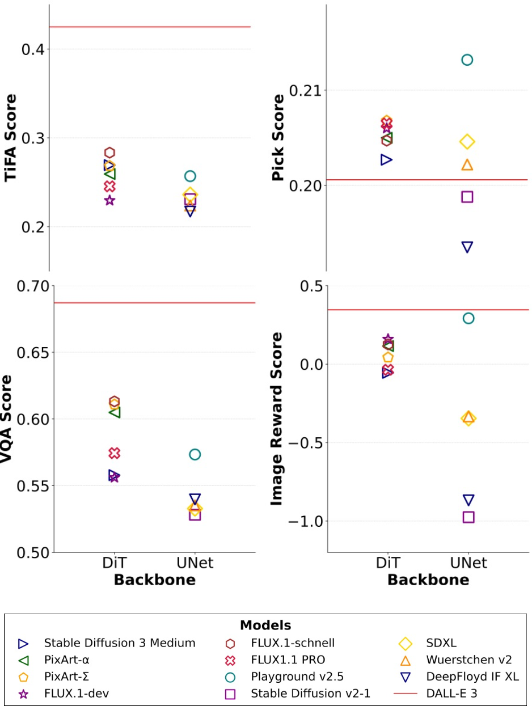
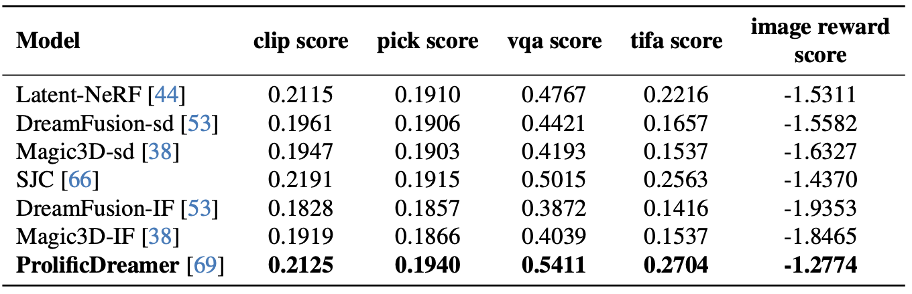

<h1 align="center"> Generate Any Scene: Evaluating and Improving Text-to-Vision Generation with Scene Graph Programming</h2>


<h2 align="center"> <a href="https://generate-any-scene.github.io/">🌐 Website</a> | <a href="https://arxiv.org/abs/2412.08221">📑 Paper</a> | <a href="https://huggingface.co/datasets/UWGZQ/GenerateAnyScene">🤗 Caption Dataset</a>


**Generate Any Scene** is a framework designed to systematically evaluate and improve text-to-vision models by generating a vast array of synthetic captions derived from dynamically constructed scene graphs. These scene graphs can represent almost any kind of scene, from realistic to imaginative compositions.

<!-- --- -->

<!-- **Ziqi Gao<sup>*</sup><sup>1</sup>, Weikai Huang<sup>*</sup><sup>1</sup>, Jieyu Zhang<sup>1</sup>, Aniruddha Kembhavi<sup>2</sup>, Ranjay Krishna<sup>1,2</sup>**

<sup>1</sup>University of Washington  
<sup>2</sup>Allen Institute for AI  
<sup>*</sup>Equal Contribution -->
<!-- --- -->


## Installation and Usage
### For Captions Generation
You can easily download the repo and set up the environments via:
```
git clone https://github.com/JieyuZ2/TaskMeAnything.git
cd ./TaskMeAnything

pip install -r requirements.txt
```
After downloading the repo, you can generate captions using the following command:
```
python generation.py \
  --metadata_path ./metadata \
  --output_dir ./output \
  --total_prompts 10 \
  --num_files 2 \
  --min_complexity 4 \
  --max_complexity 7 \
  --min_attributes 1 \
  --max_attributes 4 \
  --modality_type text2image
```

### For Model Inference and Evaluation
Stay tuned!


## What is Generate Any Scene

Generative models have shown remarkable capabilities in producing images, videos, and 3D assets from textual descriptions. However, current benchmarks predominantly focus on real-world images paired with captions. To address this limitation, we introduce **Generate Any Scene**, a novel framework that:

- Systematically enumerates **scene graphs** using a structured taxonomy of visual elements—encompassing objects, attributes, and relations—to produce almost infinite varieties of scenes.
- Leverages **Scene Graph Programming**, a method to dynamically construct scene graphs and translate them into coherent captions.
- Provides a means to scale evaluation of text-to-vision models beyond standard benchmarks, enabling evaluation on both realistic and highly imaginative scenarios.

Our evaluations on various text-to-image, text-to-video, and text-to-3D models provide key insights into model capabilities and limitations. For instance, we find that text-to-image models with DiT backbones better align with captions compared to those with UNet backbones. Text-to-video models struggle with balancing visual dynamics and consistency, while text-to-3D models show significant gaps in aligning with human preferences.

We further demonstrate the practical utility of **Generate Any Scene** with three applications:

1. **Self-Improvement Framework**: Iteratively improving a model using its own generations guided by generated captions.
2. **Distillation Process**: Transferring specific strengths from proprietary models to open-source counterparts.
3. **Content Moderation Enhancement**: Identifying and generating challenging synthetic data to improve content moderation models.

---

## Scene Graph Programming

**Metadata Types:**

| Metadata Type    | Number   | Source           |
|------------------|----------|------------------|
| Objects          | 28,787   | WordNet          |
| Attributes       | 1,494    | Wikipedia, etc.  |
| Relations        | 10,492   | Robin            |
| Scene Attributes | 2,193    | Places365, etc.  |

**Caption Generation Process:**

1. **Scene Graph Structure**: Enumerate graph structures that include nodes (objects), attributes, and relations.
2. **Populating Metadata**: Assign specific content to each node from the metadata pool.
3. **Scene Attributes**: Sample contextual details such as art style or camera settings.
4. **Caption Formation**: Combine the scene graph and scene attributes into a coherent text description.

<p align="center">
  
</p>

---

## Overall Results

### Text-to-Image

<p align="center">
  
</p>
*Comparative evaluation of text-to-image models using TiFA-Score, Pick-Score, VQA-Score, and Image-Reward-Score on 10K **Generate Any Scene** captions.*

### Text-to-Video

<p align="center">
  
</p>
*Overall performance of text-to-video models on 10K **Generate Any Scene** captions.*
  
<p align="center">
  
</p>
*Performance of text-to-video models on VBench metrics.*

### Text-to-3D

<p align="center">
  
</p>
*Performance of text-to-3D models on 10K **Generate Any Scene** captions using VBench metrics.*

---

## Applications

<p align="center">
  
</p>

### Application 1: Self-Improving

<p align="center">
  
</p>

We iteratively improve models by leveraging **Generate Any Scene** captions. Given a model's generated images, we select the best generations and fine-tune the model on them, leading to performance boosts. Stable Diffusion v1.5 gains around 5% performance improvements, outperforming even fine-tuning on real CC3M captions.

### Application 2: Distilling Limitations

<p align="center">
  
</p>

We identify and distill the specific strengths of proprietary models into open-source counterparts. For example, DALL·E 3's compositional prowess is transferred to Stable Diffusion v1.5, effectively closing the performance gap in handling complex multi-object scenes.

### Application 3: Improving Content Moderation

<p align="center">
  
</p>

By using **Generate Any Scene** to generate challenging synthetic data, we train content moderators to better detect generated imagery. This robustifies detectors across different models and datasets, improving the reliability and safety of generative AI.

---

## Citation

If you find **Generate Any Scene** helpful in your work, please cite:

```bibtex
@misc{gao2024generatesceneevaluatingimproving,
      title={Generate Any Scene: Evaluating and Improving Text-to-Vision Generation with Scene Graph Programming}, 
      author={Ziqi Gao and Weikai Huang and Jieyu Zhang and Aniruddha Kembhavi and Ranjay Krishna},
      year={2024},
      eprint={2412.08221},
      archivePrefix={arXiv},
      primaryClass={cs.CV},
      url={https://arxiv.org/abs/2412.08221}, 
}